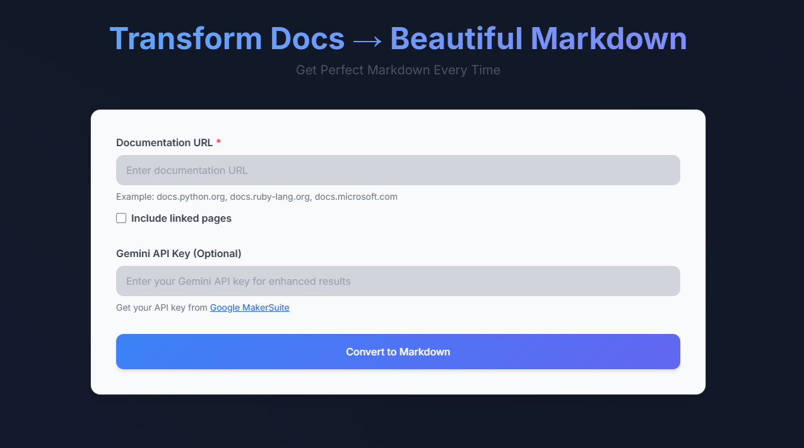

# Beautiful Markdown

A powerful tool that transforms web-based documentation into clean, well-formatted Markdown.



## Features

- Converts HTML documentation to clean, well-formatted Markdown
- Automatically generates table of contents
- Preserves code blocks and formatting
- Handles nested documentation structures
- Optional Gemini AI integration for enhanced content processing
- Supports depth-based crawling
- Dark mode support
- Copy to clipboard functionality
- Download as .md file

## Installation

1. Clone the repository:
   ```bash
   git clone https://github.com/paulelliotco/beautiful-markdown.git
   cd beautiful-markdown
   ```

2. Install dependencies:
   ```bash
   pip install -r requirements.txt
   ```

## Usage

1. Start the server:
   ```bash
   python server.py
   ```

2. Open your browser and navigate to `http://localhost:8000`

3. Enter the documentation URL you want to convert

4. (Optional) Add your Gemini API key for enhanced processing

5. Click "Convert" and wait for the results

## Contributing

This repository is protected. All changes must be made through pull requests:

1. Fork the repository
2. Create a new branch for your feature: `git checkout -b feature-name`
3. Make your changes
4. Push to your fork: `git push origin feature-name`
5. Create a Pull Request
6. Wait for review and approval

### Pull Request Guidelines

- All changes must be made through pull requests
- Direct pushes to master are not allowed
- Pull requests require review and approval
- Status checks must pass before merging
- Keep changes focused and well-documented
- Include tests if applicable

For major changes:
1. Open an issue first to discuss the proposed changes
2. Get approval before proceeding with implementation
3. Reference the issue in your pull request